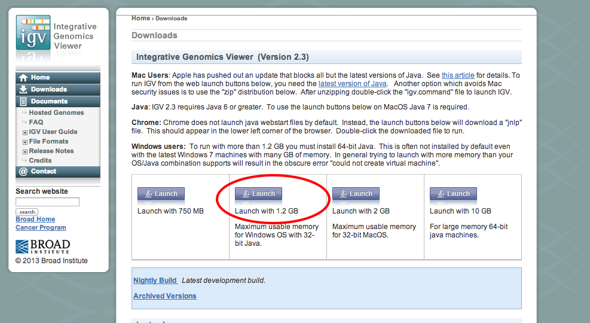
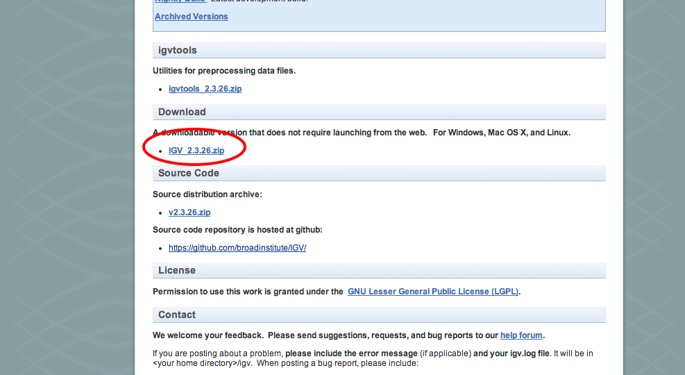
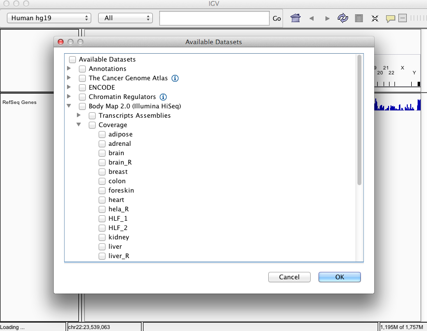

% RNA-seq Hands-on Tutorial
% Sean Davis <sdavis2@mail.nih.gov>
% February 2014

# File Formats and RNA-seq

Three file formats are used commonly in sequencing analysis and in RNA-seq, specifically.  In the following sections, these file formats:

- FASTQ
- SAM/BAM
- GTF

are presented with some exercises.  The goal of these exercises is not to be an expert in the file formats but to understand what types of information are captured by each of the formats.  Only by understanding what is in (and not in) a file of a certain format can one begin to understand what might be possible given a file or when searching for files that might meet your analysis needs.

## FASTQ format

From the [Wikipedia FASTQ entry](http://en.wikipedia.org/wiki/FASTQ_format):

> FASTQ format is a text-based format for storing both a biological sequence (usually nucleotide sequence) and its corresponding quality scores. Both the sequence letter and quality score are encoded with a single ASCII character for brevity. It was originally developed at the Wellcome Trust Sanger Institute to bundle a FASTA sequence and its quality data, but has recently become the de facto standard for storing the output of high throughput sequencing instruments such as the Illumina Genome Analyzer.

There are several flavors of FASTQ, but all share the same format.

- Line 1 begins with a '@' character and is followed by a sequence identifier and an optional description (like a FASTA title line).
- Line 2 is the raw sequence letters.
- Line 3 begins with a '+' character and is optionally followed by the same sequence identifier (and any description) again.
- Line 4 encodes the quality values for the sequence in Line 2, and must contain the same number of symbols as letters in the sequence.

```
@SOLEXA:1:1:11:1484#1
AACAGTTGCTGCAAGACCTATGACCACCACTGCCTTTCCCACCACGCAGAGGCCCAGATCGGAAGAGCGTCGTGTAGGGA
+
IF2I?>I5:<42I;:G-5IG:,?&*I;.F*I@,%5;C*)+C)+1+8I25-7,)))+:*.)+-)00/&&*+&%+*')+$**
@SOLEXA:1:1:11:1045#1
TCCCGGGCTTCTTACCCATTTAAAGTTTGAGAATAGGTTGAGATCGTTTCGGCCCCAAGACCTCTAATCATTCGCTTTAC
+
E73=I<C,?>-<?H)1/7?II8>6I6III8;<:?>9=2=<A4-5*E61?400*"&&;.6.'#-&79&2(11+#-%+,+-'
@SOLEXA:1:1:11:542#1
CACCTGTGAAAAATGAGGAAGATGTTGCAGAGTTGTCAATTTCTCCTTCAGACAATGCAGTGGAGATCGGAAGAGCGTCG
+
II;III?GHIIIIIIIII:II8IIIIC>II7IAIII3IEIII:I4+I;/6I=.<5?G+>/&*E-5:2,10/&4.&$++#+
@SOLEXA:1:1:11:952#1
TCCCTGTCTGTGTACAAATTAATCATGGGCTGTCCCGTTTTCTTGTTTGTCTTAATAATACCAATCTGCTTAGATCGGAA
+
IH>AII<IIIFIII<II@IIICI2IAEII0II8+1,:4=DF.@=24GA.2'9H469D+50)*C10&1-+4/*.0."+&0+
@SOLEXA:1:1:11:1221#1
GGGGAGGGGGCGGCGGGAAGGCACCTCCCAGAGCACCCTCTGCATCGTCGCCATCCCCAGCAAGGGGAGGTGGAGGCAGG
+
A7;A&@>0,(-+,,+0'00)0+4%*21.*5%5*(4$*(++3&(--&4)(&%&%*&&'%+#&$)%++%$%($$*$&)$%+&
```

- **Exercise**: How many sequences are represented above?  What is the approximate read length?

- **Exercise**: How can you tell if the FASTQ sequences above represents the first read or the second read of a read pair?  (trick question alert)

- **Exercise**: Use the [ASCII converter tool](http://www.branah.com/ascii-converter) to convert the quality string to decimal and then subtract 33 to get the quality [PHRED score](http://en.wikipedia.org/wiki/Phred_quality_score), *Q*.  To convert to a probability, plug the resulting number into $P = 10^{\frac{-Q}{10}}$.  This probability, *P*, is the probability that the base in the read is an error.


## SAM/BAM Format

The standard data format produced by alignment softwars is the SAM/BAM format.  *SAM* stands for Sequence Alignment/Map format. It is a TAB-delimited text format consisting of a header section, which is optional, and an alignment section. If present, the header must be prior to the alignments. Header lines start with "@", while alignment lines do not. Each alignment line has 11 mandatory fields for essential alignment information such as mapping position, and variable number of optional fields for flexible or aligner specific information.  The BAM format, which we have seen more commonly, is simply a binary encoding (not readable by humans without software translation) of the SAM format.  The information in a BAM file is identical to that in a SAM file.

The [SAM format specification](http://samtools.sourceforge.net/SAMv1.pdf) describes this format in great detail.  While there is no need to know this format in great detail, it is important to understand some of the basics of what is contained in the SAM format.

### Example SAM file

SAM and BAM files are usually handled with tools that are specifically designed to deal with the format.  For the following exercises, I have use the [samtools](http://samtools.sourceforge.net/samtools.shtml) package to manipulate and view a BAM file in SAM format.  I have extracted a small section of the header and the aligned reads themselves for you to examine.

#### The SAM header

Each header line begins with character "@" followed by a two-letter record type code. In the header, each line is TAB-delimited and except the "@CO" lines, each data field follows a format "TAG:VALUE" where TAG is a two-letter string that defines the content and the format of VALUE.

The SAM header is incredibly useful because it contains high-level information about what is contained in a SAM/BAM file and may even contain information about how the file was originally created or modified.

- **Exercise**: Use the [SAM format specification](http://samtools.sourceforge.net/SAMv1.pdf) to determine what is meant by the lines in the following SAM header.

```
@HD     VN:1.0  SO:sorted
@SQ     SN:chr1 LN:249250621
@SQ     SN:chr10        LN:135534747
@SQ     SN:chr11        LN:135006516
@SQ     SN:chr12        LN:133851895
...
@SQ     SN:chrY LN:59373566
@PG     ID:TopHat       VN:1.1.4        CL:/home/radon00/cole/bin/tophat -p 4 -a 5 -F 0.0 -r 100 --tmp-dir=/broad/shptmp/nmcabili/rnaseq/human/HBM_hg19/Alignments/adipose_50 -o /seq/rinnlab/Moran/HBM_hg19/Alignments/adipose_50 --no-novel-juncs -j /seq/rinnlab/Moran/HBM_hg19/Junctions/HBM+GencodeV4+RinnNov10.juncs /seq/rinnscratch/cole/bowtie_indexes/hg19/hg19-male /broad/shptmp/nmcabili/rnaseq/human/HBM/50bp/FCB/s_1_1_sequence.txt /broad/shptmp/nmcabili/rnaseq/human/HBM/50bp/FCB/s_1_2_sequence.txt
```

#### SAM Alignment Records

In the SAM format, each alignment line typically represents the linear alignment of a segment. Each line has 11 mandatory fields. These fields always appear in the same order and must be present, but their values can be "0" or "*" (depending on the field) if the corresponding information is unavailable.

Use the following few lines from a SAM file in the exercises that follow.  Note that the SAM lines wrap around, depending on your screen width.

```
HWI-BRUNOP16X_0001:1:66:7344:97026#0    16      chr1    14613   0       75M     *       0       0       GTCTGAGCAGCTTGTCCTGGCTGTGTCCATGTCAGAGCAATGGCCCAAGTCTGGGTCTGGGGGGGAAGGTGTCAT     gegegefghbgghgfgegghfggdgfgggdgfggggggggggggghgggggggggggffgggggggggggggggg     NM:i:1  NH:i:5

HWI-BRUNOP16X_0001:1:4:9718:13473#0     73      chr1    14615   0       50M     *       0       0       CTGAGCAGCTTGTCCTGGCTGTGTCCATGTCAGAGCAACGGCCCAAGTCT      gggbggggfggggggfegdggdggdffaffadgdgggfggggcgd^Y[Q]      NM:i:0  NH:i:5

HWI-BRUNOP16X_0001:1:1:1726:175569#0    163     chr1    18350   1       17M6371N33M     =       24747   0       GTCCGGCTCTGCTCTACCTGCTGAAGATGTCTCCAGAGACCTTCTGCAGG      gggggggggggggggggggggggggggggggggggggggggggghggggg      NM:i:1  XS:A:-  NH:i:3

HWI-BRUNOP16X_0001:1:61:19757:138797#0  153     chr1    18357   0       10M6371N40M     *       0       0       TCTACTCTACCTGCTGAAGATGTCTCCAGAGACCTTCTGCAGGTACTGCA      efecfSTTNTbccc`_c[b^gecggfdefe]`_cbee_eegggegggggg      NM:i:1  XS:A:-  NH:i:5
```

- **Exercise**: How many SAM records are present in the listing above?  What are the read lengths of the reads represented and how could you tell?

- **Exercise**: Use the [SAM format specification](http://samtools.sourceforge.net/SAMv1.pdf) to identify the mandatory fields and their values for each SAM record above.

- **Exercise**: Using the [SAM format specification](http://samtools.sourceforge.net/SAMv1.pdf), determine the meaning of the *CIGAR* string (column 6 in each SAM record) for each SAM record.  In particular, what does the "N" operator in the *CIGAR* string mean?

- **Exercise**: Using the ["Explain Flags" tool](http://picard.sourceforge.net/explain-flags.html), determine what the *flag* column in each SAM record means.  The *flag* is in Column 2 of each SAM record, so cut-and-paste this value into the "Explain Flags" tool.

- **Exercise**: Using the [SAM format specification](http://samtools.sourceforge.net/SAMv1.pdf) again, determine the meaning of the optional tags, *NM*, *NH*, and *XS*.  For the last one, you may need to do a google search, as the *XS* tag is not defined explicitly by the SAM format.


## GTF Format

GTF stands for [Gene Transfer Format](http://mblab.wustl.edu/GTF22.html). This format is used by many software packages for describing the structure of transcripts (introns, exons, start sites, UTRs, etc.) and how transcripts are related to the genes they encode.  GTF is a tab-delimited text format and the fields are:

```
<seqname> <source> <feature> <start> <end> <score> <strand> <frame> [attributes] [comments]
```

The first eight columns represent locations along the genome, information about how those regions were defined, and what they represent.  The [attributes] column contains information about the relationships between genes and their transcripts.  A small subset of a GTF file looks like:


```
20	protein_coding	exon	9873504	9874841	.	+	.	gene_id "ENSBTAG00000020601"; transcript_id "ENSBTAT00000027448"; gene_name "ZNF366";
20	protein_coding	CDS	9873504	9874841	.	+	0	gene_id "ENSBTAG00000020601"; transcript_id "ENSBTAT00000027448"; gene_name "ZNF366";
20	protein_coding	exon	9877488	9877679	.	+	.	gene_id "ENSBTAG00000020601"; transcript_id "ENSBTAT00000027448"; gene_name "ZNF366";
20	protein_coding	CDS	9877488	9877679	.	+	0	gene_id "ENSBTAG00000020601"; transcript_id "ENSBTAT00000027448"; gene_name "ZNF366";
20	protein_coding	exon	9888412	9888586	.	+	.	gene_id "ENSBTAG00000020601"; transcript_id "ENSBTAT00000027448"; gene_name "ZNF366";
20	protein_coding	CDS	9888412	9888586	.	+	0	gene_id "ENSBTAG00000020601"; transcript_id "ENSBTAT00000027448"; gene_name "ZNF366";
20	protein_coding	exon	9891475	9891998	.	+	.	gene_id "ENSBTAG00000020601"; transcript_id "ENSBTAT00000027448"; gene_name "ZNF366";
20	protein_coding	CDS	9891475	9891995	.	+	2	gene_id "ENSBTAG00000020601"; transcript_id "ENSBTAT00000027448"; gene_name "ZNF366";
```

In RNA-seq analysis, GTF files arise in two different contexts:

- The first is in describing the *known* transcriptome; alignment algorithms can take advantage of this information to achieve better alignments.
- The second is in describing the output of an algorithm meant to discover *new* transcripts.  When the algorithm has run, the output will often be a GTF file describing the results of the analysis.

# Quality Control of RNA-seq data

## FastQ Quality Control

As you now know, the FastQ format represents the raw reads from the sequencer.  This file format contains the sequence as well as the sequencer's assessment of the probability of each base being correctly called.  There are a number of tools for evaluating the quality of sequencing based on the FastQ file itself, but a commonly-used one is [FastQC](http://www.bioinformatics.babraham.ac.uk/projects/fastqc/).  This software can be run on the linux command-line or as a desktop application.  In either case, the result is a set of files, including an web report of the results.  In this section, you will review results from a "good" sequencing run and from a "bad" one.

- **Exercise**: Consider viewing the [FastQC tutorial video](http://www.youtube.com/watch?v=bz93ReOv87Y) for an overview of FastQC use and results.

For the next two exercises, use the [FastQC documentation on each analysis module](http://www.bioinformatics.babraham.ac.uk/projects/fastqc/Help/3%20Analysis%20Modules/) to help interpret results.

- **Exercise**: Review the results from a [good illumina dataset](http://www.bioinformatics.babraham.ac.uk/projects/fastqc/good_sequence_short_fastqc/fastqc_report.html).

- **Exercise**: Review the results from a [poor illumina dataset](http://www.bioinformatics.babraham.ac.uk/projects/fastqc/bad_sequence_fastqc/fastqc_report.html).

- **Exercise**: Compare and contrast the good and poor datasets.  What do you think might have happened in the "poor" dataset?

## RNA-seq QC after alignment

After the reads have been aligned to the genome using a splice-aware alignment algorithm, the data are available in BAM (or SAM) format files.  We can begin to ask more RNA-seq specific questions about quality at this point in the analysis pipeline.  Again, a number of tools are available for RNA-seq quality control (many with very similar names).  In this little section of the tutorial, you will be reviewing RNASeqQC results from a small dataset consisting of four samples.

- **Exercise**: Using the [documentation in this pdf](http://www.broadinstitute.org/cancer/cga/sites/default/files/data/tools/rnaseqc/RNA-SeQC_Help_v1.1.2.pdf) (go to the section that starts with "index.html"), evaluate the quality of the four samples [given here](http://watson.nci.nih.gov/~sdavis/tutorials/rnaseqQCexample/index.html).  This is a fairly good RNA-seq dataset, so I just want you to get a sense of what "good" looks like.

- **Exercise**: Evaluate the RNASeqQC results [here](http://watson.nci.nih.gov/~sdavis/tutorials/rnaseqQCBadExample/index.html).  What differences do you see between the examples in the first exercise and those in this RNASeqQC analysis?  Is this simple a good RNA-seq sample?  If not, what is wrong with it?  

# Visualizing RNA-seq Data

For this section of the tutorial, we will be examining data generated as part of the [Human Body Map](http://www.ensembl.info/blog/2011/05/24/human-bodymap-2-0-data-from-illumina/).

>The data, generated on HiSeq 2000 instruments in 2010, consist of 16 human tissue types, including adrenal, adipose, brain, breast, colon, heart, kidney, liver, lung, lymph, ovary, prostate, skeletal muscle, testes, thyroid, and white blood cells. Raw reads are available for download. For each tissue, we have aligned the raw reads to the genome and then linked exons into tissue-specific transcript models using the reads that span an exon-exon boundary.

There are a number of different options for visualizing RNA-seq data.  I encourage you to investigate others, but today we will be focusing on the [Integrated Genomic Viewer (IGV)](http://www.broadinstitute.org/software/igv/), developed at the Broad Institute.  This software is easy to use, free, fast, and runs on your own computer.

The goals of this section are to:

- Using visualization, get a "feel" for RNA-seq data.
- Become familiar with a tool for visualization of RNA-seq data.
- See how various features of RNA-seq data look in a real dataset.

While one can learn a great deal from visualization, visualization does not represent an "analysis"; other tools are necessary.

## Getting IGV

### Method #1

1. Go to http://www.broadinstitute.org/software/igv/.
2. Click on the "Downloads" button on the left side of the screen.
3. You may need to "register" for the download.  This is simply so the developers get your email for tracking users at grant time.
4. Click on the "Launch" link.


### Method #2

In some cases, IGV will not launch automatically after Method #1.  In these cases (*only if Method #1 does not work*), we will need to follow a slightly different path.  Follow steps 1-3 as for Method #1 above.  Then,

1. Click on the link as shown below:

2. Unzip the resulting download.
3. Launch the Terminal (Mac) under Applications -> Utilities.
4. In the Terminal, type:
```
cd Downloads/IGV*
./igv.sh
```

You should have IGV running on your own machine at this point.

## Visualizing Data Using IGV

### Gene Expression

*Before proceeding, in IGV, be sure to choose the "Human hg19" genome in the upper left corner of the IGV screen.*

For examining gene expression in IGV, we will be using so-called *coverage* data.  These data were generated by counting the number of reads, after alignment to the genome, in our RNA-seq sample that overlap with each base.  For this exercise, the coverage data have been normalized to be comparable across samples.  This will allow us to examine relative expression between any samples that we like.  

- **Exercise**: Load five different sample types of coverage data into IGV.  You choose the sample types you like.  Choose File -> Load from Server and then choose "Body Map Coverage":



- **Exercise**: Search for three genes in IGV.  Are your genes expressed in all samples, some samples, or not expressed at all?

- **Exercise**: How much intergenic coverage is present?  How about intronic coverage?  What does intergenic or intronic coverage represent, potentially?

- **Exercise**: Do the areas of high coverage support known transcripts? 

- **Exercise**: Find a tissue-specific gene based on the coverage tracks and your knowledge of the biology of various tissues.

#### Read Counts

Looking for genes that behave in a specific way visually can be somewhat challenging in a browser.  More typically, the data are summarized to the gene or transcript level and put into a tab-delimited text file or Excel spreadsheet.  We need to perform *read counting*.  Note that this is **not** the same as coverage since we are counting the number of reads that support a given gene, not the number of reads that cover a given base.  

From a recent review entitled ["Count-based differential expression analysis of RNA sequencing data using R and Bioconductor"](http://www.nature.com/nprot/journal/v8/n9/full/nprot.2013.099.html):

> In principle, counting reads that map to a catalog of features is straightforward. However, a few subtle decisions need to be made.  For example, how should reads that fall within intronic regions (i.e., between two known exons) or beyond the annotated regions be counted? Ultimately, the answer to this question is guided by the chosen catalog that is presented to the counting software; depending on the protocol used, users should be conscious to include all features that are of interest, such as polyadenylated RNAs, small RNAs, long intergenic noncoding RNAs and so on. For simplicity and to avoid problems with mismatching chromosome identifiers and inconsistent coordinate systems, we recommend using the curated FASTA files and GTF files from Ensembl or the prebuilt indices packaged with GTF files from http://tophat.cbcb.umd.edu/igenomes.shtml whenever possible.

> Statistical inference based on the NB distribution requires raw read counts as input. This is required to correctly model the Poisson component of the sample-to-sample variation. Therefore, it is crucial that units of evidence for expression are counted. No prior normalization or other transformation should be applied, including quantities such as RPKM (reads per kilobase model), FPKM (fragments per kilobase model) or otherwise depth-adjusted read counts. Both DESeq and edgeR internally keep the raw counts and normalization factors separate, as this full information is needed to correctly model the data. Notably, recent methods to normalize RNA-seq data for sample-specific G+C content effects use offsets that are presented to the GLM, while maintaining counts on their original scale63,64.

> Each paired-end read represents a single fragment of sequenced DNA, yet (at least) two entries for the fragment will appear in the corresponding BAM files. Some simplistic early methods that operated on BAM files considered these as separate entries, which led to overcounting and would ultimately overstate the significance of differential expression.

> Typically, there will be reads that cannot be uniquely assigned to a gene, either because the read was aligned to multiple locations (multi-reads) or the read's position is annotated as part of several overlapping features. For the purpose of calling differential expression, such reads should be discarded. Otherwise, genuine differential expression of one gene might cause another gene to appear differentially expressed, erroneously, if reads from the first gene are counted for the second due to assignment ambiguity. 

Examples of how counting might look in practice are given in the following figure:


A detailed discussion is available on the [HTSeq website](http://www-huber.embl.de/users/anders/HTSeq/doc/count.html) for those who want to investigate further.

I performed read counting on the bodymap data and performed a transformation (using voom from the bioconductor limma package) to make the data comparable across samples.

- **Exercise**: Download the [read count data](CountTable.txt) and load it into Excel.

The data have been transformed to be roughly on the log2 scale, so there may be negative values.  In addition, to determine a fold-change, one needs to subtract rather than divide two samples' expression values.

- **Exercise**: Again find some tissue-specific genes, but using the read counts in Excel as a guide.

## Splicing and Isoform Visualization

While gene expression is the most common use for RNA-seq, there is abundant information regarding transcript structure, splicing, and alternativel isoforms.  There are numerous tools and approaches that use the information inherent in RNA-seq reads to look for differential isoform expression, define new isoforms for known genes, and even to look for novel transcripts not represented in any known annotation.  Unfortunately, these methods are still an active area of research and no "gold standard" best methods have emerged.

With the goal of simply viewing the simplicity *and* complexity of RNA-seq data at the level of the transcript, we need to move away from simple genomic coverage and read counts to the actual read alignments as represented in the BAM file.

- **Exercise**:  In IGV, start a new session and load a single Body Map alignment track for your favorite tissue type.  How many tracks were loaded?  Do a search for a gene and then zoom in far enough that you begin to see alignments.

Notice that you have two new track types, the alignments and the Sashimi plot track.

- **Exercise**:  Take a moment to glance at [this paper](http://arxiv.org/abs/1306.3466) for an explanation of the Sashimi plot.  Interpret the Sashimi plot for the current gene.

- **Exercise**:  The data produced for the Body Map project were not generated using a strand-specific protocol.  How is the directionality of the splicing in the Sashimi plot determined?  If you need a hint, go back to the SAM file listing in the File Formats section and examine the tags in the alignments.

- **Exercise**:  Find an example of two or more isoforms for the same gene begin expressed.

- **Exercise**:  Find an example of exon skipping.

- **Exercise**:  Load another example sample and look for alternative isoform expression that appears to be relatively tissue-specific (this may be difficult).

## Sequence Variants in RNA-seq data

RNA-seq data contains information about small variants such as Single Nucleotide Variants (SNVs) and small insertions and deletions (indels).  Genome viewers allow visualization of data from a very high level (coverage, for example), a medium level (intron/exon structure), and very fine level.  In this little exercise, left as a freeform exercise, use IGV to examine small variants in the Body Map data.

- **Exercise**: Find some examples of SNVs or other small variants.

- **Exercise**: Find some SNVs that appear to distinguish one sample from another.

- **Exercise**: Find a variant that appears to show allele-specific expression (does not fit 0%, 50%, or 100% expression level).

- **Exercise**: Evaluate your variants with respect to known variants.  To do so, load the dbSNP 1.3.7 track from the Server.  Look for overlap between your observed variants and those annotated in dbSNP.  For those not in dbSNP, do you have any hypotheses about what those represent?


  <script type="text/javascript">

    var _gaq = _gaq || [];
    _gaq.push(['_setAccount', 'UA-2851481-1']);
    _gaq.push(['_trackPageview']);

    (function() {
    var ga = document.createElement('script'); ga.type = 'text/javascript'; ga.async = true;
    ga.src = ('https:' == document.location.protocol ? 'https://' : 'http://') + 'stats.g.doubleclick.net/dc.js';
    var s = document.getElementsByTagName('script')[0]; s.parentNode.insertBefore(ga, s);
    })();

  </script>
